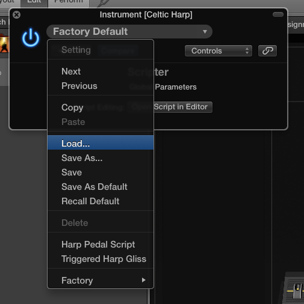

Mainstage Scripts
=================

This is a repository for scripts I've created for the Mainstage 3 MIDI Scripter.

Currently there's only one script: a harp gliss trigger script that will play a gliss with a single keypress.

Directions
==========

Step 1: Download
----------------

Download the current [zip file](https://github.com/brianhv/mainstagescripts/archive/master.zip).

Step 2: Install (optional)
--------------------------

Open the zip file you downloaded in step one and move the .pst file from it into `Music/Audio Music Apps/Plug-In Settings/Scripter` in your home directory. The Scripter directory may not exist yet; create it if it does.

Installing is recommended if you'll be using the script more than once. It makes it easier to activate the script by adding the script to a menu.

Step 3: Create harp channel
---------------------------

Open Mainstage and create or navigate to a patch that contains a harp channel.

Step 4: Activate Scripter
-------------------------

Go to the harp channel strip. Click on the box next to `MIDI FX` and choose `Scripter`.

Step 5: Load script
-------------------

Click on the pop-up menu that says `Factory Default`. If you installed the script in step 2, it should appear in the menu.

If you didn't install it, choose `Load` instead and load the .pst file from the zip file.

Step 6: Use script
------------------

You should now see a configuration screen that looks like the above.

You can use the pitch menus to define the tonality of the gliss. For example, to execute a D major gliss, change the C and F menus to `Sharp` and leave the rest on `Natural`.

`Length Of Gliss` defines the number of notes that will be in the gliss.

`Delay Between Notes` defines the speed of the gliss. A lower delay will result in a faster gliss.

`Direction` defines the direction of the gliss.

Notes
=====

* This script will currently only trigger from white keys to make it clear which "string" the gliss starts on. To trigger from a black key, use Mainstage's `Transpose` feature for the channel strip under `MIDI Input`.
* You may also use the `Transpose` feature if you want the gliss to start on a different note than the one you use to trigger the gliss.
